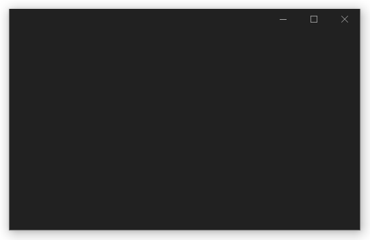

# FxStage

[  ](https://search.maven.org/artifact/io.github.micheljung/fxstage)


A small library to create borderless JavaFX stages with native window behaviour.

## Features

* Borderless UI
* Native window behavior (Windows 10 only)
  * Drop shadow
  * Window resizing
  * Aero Snap
* Fallback to cross-platform Windows 10 imitation
* Minimally-invasive
* Fully customizable

## Screenshot



## Usage

Convert an existing stage:

```
FxStage.configure(stage).apply();
```

## Get It Now

Get it via https://search.maven.org/artifact/io.github.micheljung/fxstage

```
repositories {
  mavenCentral()
}

dependencies {
  implementation 'ch.micheljung.fxstage:fxstage:0.8.1'
}
```

## Important

* The API is not yet polished and might change in future
* Cross-platform Windows 10 imitation is yet buggy
* Requires Java 11+

# Other projects

Also check out https://github.com/micheljung/jfx-waitomo-theme
